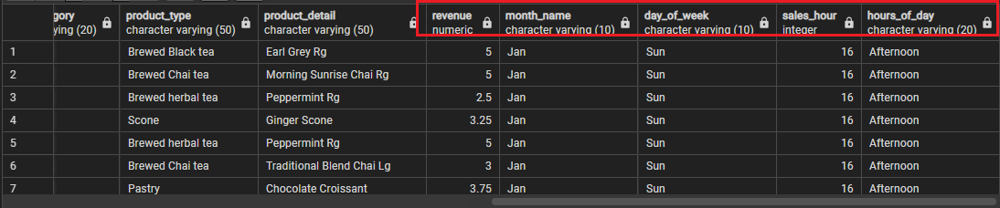
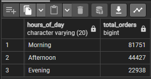

# Maven-Roasters-Analysis-SQL-Project

Photo by [Nathan Dumlao](https://unsplash.com/photos/three-person-holding-beverage-cups-6VhPY27jdps) from [unsplash](https://unsplash.com)

## Introduction
Maven Roasters is a coffee shop with three locations in New York City namely Lower Manhattan, Hell's Kitchen and Astoria. Maven Roasters aims to understand and optimize the performance of the coffee shop by analyzing various aspects of sales data, such as daily and monthly sales trends, popular products, peak hours, customer demographics, and behaviour.
I will be playing the role of a business analyst for Maven Roasters, a bespoke, small batch coffee roasting company.

## About Dataset
The dataset used is fictional and sourced from Maven Analytics. It contains order details of all transactions recorded from January to June 2023 and it also contains 11 columns and 149116 rows.

## Data Wrangling / Approach
The initial step involves performing data cleaning on the dataset. Surprisingly there are no duplicated transaction records in the dataset.

1. Creating a database.
   ```sql
   CREATE DATABASE IF NOT EXISTS maven_roasters;
   ```
3. Creating a table.
   ```sql
   CREATE TABLE IF NOT EXISTS sales(
    transaction_id INT NOT NULL,
    transaction_date DATE NOT NULL,
    transaction_time TIME NOT NULL,
    store_id INT NOT NULL,
    store_location VARCHAR(20) NOT NULL,
    product_id INT NOT NULL,
    transaction_qty INT NOT NULL,
    unit_price FLOAT NOT NULL,
    product_category VARCHAR(20) NOT NULL,
    product_type VARCHAR(50) NOT NULL,
    product_detail VARCHAR(50) NOT NULL
   )
   ```
3. ### Data Importation from CSV <br/>
   After creating a database and table, now it’s time to import data from a CSV file. For this select and right-click on the table sales and a new window open then I select the path 
   from the local machine where I stored the dataset.
   

5. ### Data Transformation
   - Add a new column named Revenue. This column will help us to know how much revenue Maven Roasters made during this six month

   ```sql
    SELECT  (transaction_qty *unit_price) AS revenue FROM sales;
      
    ALTER TABLE 
      sales
    ADD COLUMN revenue DECIMAL;
      
    UPDATE 
      sales 
    SET 
      revenue = transaction_qty *unit_price;
     ```

   - Add new columns to calculate Month and Day of Week based on the transaction date and I named these columns month_name and day_of_week. *(BONUS: display them as text (i.e. “Jan”, “Feb”, “Sun”, “Mon”)*.
  
   `Month`

   ```sql
    SELECT 
      TO_CHAR(transaction_date::DATE,'Mon') AS month_name 
    FROM sales;
      
    ALTER TABLE 
       sales 
    ADD COLUMN
       month_name VARCHAR(10);
      	
    UPDATE 
      sales
    SET
      month_name = TO_CHAR(transaction_date::DATE,'Mon');
     ```

   `Day of week`
   
     ```sql
     SELECT 
        TO_CHAR(transaction_date::DATE,'Dy') AS day_of_week 
     FROM sales;
         
     ALTER TABLE 
        sales 
     ADD COLUMN 
        day_of_week VARCHAR(10);
     UPDATE
        sales
     SET
        day_of_week = TO_CHAR(transaction_date::DATE,'Dy');
     ```
   - Add a new column to extract Hour from the transaction time
    
   ```sql
    SELECT EXTRACT(HOUR FROM transaction_time) AS sales_hour FROM sales;
    ALTER TABLE sales ADD COLUMN sales_hour INT;
    UPDATE sales SET sales_hour = EXTRACT(HOUR FROM transaction_time);
      
   SELECT 
      CASE 
         WHEN EXTRACT(HOUR FROM transaction_time) < 12 THEN 'Morning'
         WHEN EXTRACT(HOUR FROM transaction_time) < 17 THEN 'Afternoon'
              ELSE  'Evening' 
      END AS hours_of_day
   FROM sales;
      
   ALTER TABLE sales ADD COLUMN hours_of_day VARCHAR(20);
      
   UPDATE sales SET hours_of_day = (
      CASE 
         WHEN EXTRACT(HOUR FROM transaction_time) < 12 THEN 'Morning'
         WHEN EXTRACT(HOUR FROM transaction_time) < 17 THEN 'Afternoon'
              ELSE  'Evening' 
      END);
   ```
_An updated dataset with revenue, month_name, day_of_week, sales_hour and hours_of_day_


## Exploratory Data Analysis
Exploratory data analysis is done to answer the listed questions and aims of this project.

1. How many unique stores location does the data have?
      ```sql
       SELECT
         COUNT(DISTINCT store_location)
       FROM sales;
      ```
   

2. How many unique product category does the data have?
      ```sql
      SELECT
          COUNT(DISTINCT product_category)
      FROM sales;
      ```
   
   
3. What is the store location with the largest and lowest revenue?
      ```sql
      SELECT 
         store_location,
      	SUM(revenue) total_revenue
      FROM sales
      GROUP BY store_location
      ORDER BY total_revenue DESC;
   ```
   

4. Which product category has been selling more and which one is selling less in terms of revenue?
      ```sql
      SELECT 
          product_category,
          ROUND(SUM(revenue),2) AS total_amount 
      FROM coffee_sales
      GROUP BY product_category
      ORDER BY total_amount  DESC;
      ```
   
   
5. What is the number of transactions that are happening each month and their total bill amount?
   ```sql
   SELECT
       month_name,
       COUNT(*) AS num_transaction,
       ROUND(SUM(revenue),2) AS total_amount
   FROM sales
   GROUP BY month_name
   ORDER BY total_amount DESC;
   ```   

   
6. On which day ie day name of the week has more sales and which one has less Any suggestions to improve for those on fewer sales days?.
```sql
   SELECT
       day_of_week,
       COUNT(transaction_id) AS num_sales
   FROM sales
   GROUP BY day_of_week
   ORDER BY num_sales DESC;
```


7. Which time of the day do customers visits the stores.
   ```sql
   SELECT 
	  hours_of_day,
	  COUNT(transaction_id) AS total_orders
   FROM sales
   GROUP BY hours_of_day
   ORDER BY total_orders DESC;
   ```

   
